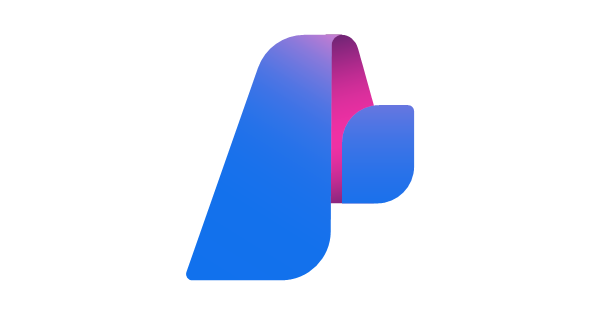
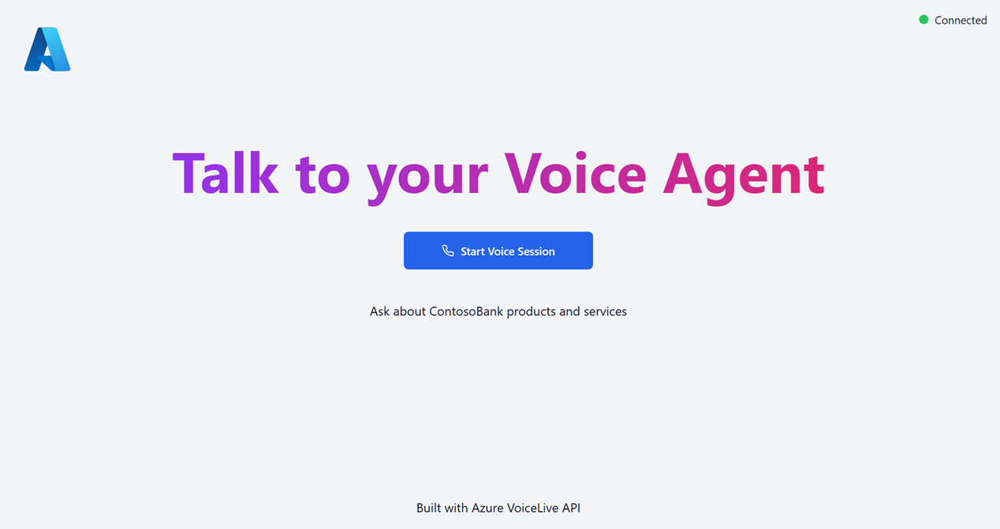

# RAG-enabled Voice agent with Azure AI Voice Live API

This sample demonstrates how to build a real-time voice assistant with Retrieval-Augmented Generation (RAG) capabilities using [Azure AI Voice Live API](https://learn.microsoft.com/en-us/azure/ai-services/speech-service/voice-live) and Azure AI Search. It showcases a complete end-to-end solution where users can have natural voice conversations with an AI agent that retrieves and references information from your own documents and knowledge base. With Voice Live API, developers can easily voice-enable any agent built with the [Azure AI Foundry Agent Service](https://learn.microsoft.com/en-us/agent-framework/user-guide/agents/agent-types/azure-ai-foundry-agent?pivots=programming-language-python).

### What This Sample Demonstrates

- **Real-Time Voice Conversations**: Bi-directional speech-to-speech interaction powered by Voice live
- **RAG Integration**: Seamless integration with Azure AI Search for document retrieval and grounded responses
- **Full-Stack Architecture**: React/TypeScript frontend with FastAPI backend, deployable to Azure Container Apps
- **Azure AI Foundry Agents**: Voice-enable agents built with the Azure AI Foundry Agent Service
- **Production-Ready Deployment**: Complete `azd` template for one-command deployment to Azure

## 🔧 Prerequisites

+ [azd](https://learn.microsoft.com/azure/developer/azure-developer-cli/install-azd), used to deploy all Azure resources and assets used in this sample.
+ [PowerShell Core pwsh](https://github.com/PowerShell/powershell/releases) if using Windows
+ [Python 3.10](https://www.python.org/downloads/release/python-3100/)
+  [An Azure Subscription](https://azure.microsoft.com/free/) with Contributor permissions
+  [Sign in to Azure with Azure CLI](https://learn.microsoft.com/cli/azure/authenticate-azure-cli-interactively)
+  [VS Code](https://code.visualstudio.com/) installed with the [Jupyter notebook extension](https://marketplace.visualstudio.com/items?itemName=ms-toolsai.jupyter) enabled

## 🏗️ Architecture

   ```
   ┌─────────────────────────────────────┐    ┌──────────────────┐    ┌─────────────────────┐
   │       Azure Container App           │    │  Azure Voice     │    │ Azure AI Search     │
   │                                     │    │  Live API        │    │                     │
   │  ┌─────────────────────────────────┐│    │                  │    │                     │
   │  │         Frontend Client         ││    │ ┌──────────────┐ │    │ ┌─────────────────┐ │
   │  │      (React/TypeScript)         ││    │ │ GPT-4o       │ │    │ │ Search Index    │ │
   │  │                                 ││    │ │ Realtime     │ │    │ │ & Retrieval     │ │
   │  │ ┌─────────────────────────────┐ ││    │ │ Processing   │ │    │ └─────────────────┘ │
   │  │ │ Microphone Input            │ ││    │ └──────────────┘ │    │                     │
   │  │ │ Speaker Output              │ ││    │                  │    │ ┌─────────────────┐ │
   │  │ │ Tool Call UI Display        │ ││    │                  │    │ │ Vector Store    │ │
   │  │ └─────────────────────────────┘ ││    │                  │    │ │ & Documents     │ │
   │  └─────────────────┬───────────────┘│    │                  │    │ └─────────────────┘ │
   │                    │ WebSocket      │    │                  │    │                     │
   │  ┌─────────────────▼───────────────┐│    │                  │    │                     │
   │  │        Backend API              ││    │                  │    │                     │                 WebSocket  
   │  │        (FastAPI)                ││◄──►│                  │◄──►│                     │
   │  │                                 ││    │                  │    │                     │
   │  │ ┌─────────────────────────────┐ ││    │                  │    │                     │
   │  │ │ WebSocket Handler           │ ││    │                  │    │                     │
   │  │ │ Audio Streaming             │ ││    │                  │    │                     │
   │  │ │ Tool Execution              │ ││    │                  │    │                     │
   │  │ └─────────────────────────────┘ ││    │                  │    │                     │
   │  └─────────────────────────────────┘│    │                  │    │                     │
   └─────────────────────────────────────┘    └──────────────────┘    └─────────────────────┘
            
   ```

   ## ⚙️ Set Up 

This sample uses [`azd`](https://learn.microsoft.com/azure/developer/azure-developer-cli/) and a bicep template to deploy all Azure resources:

**Create the infrastructure**
   ```bash
   # Login to Azure (if not already logged in)
   az login

   # Initialize the project (if running for the first time)
   azd init

   # Deploy infrastructure and application to Azure
   azd up
   ```

## 🎤 Talk to the agent

After the application has been successfully deployed you will see a URL printed to the console. Navigate to that URL to interact with the app in your browser. 

Ask questions like `What is the due date of my bill?` and `What are the benefits of my credit card?`




## 💣 **Delete the Resources**
   ```bash
   azd down --purge
   ```